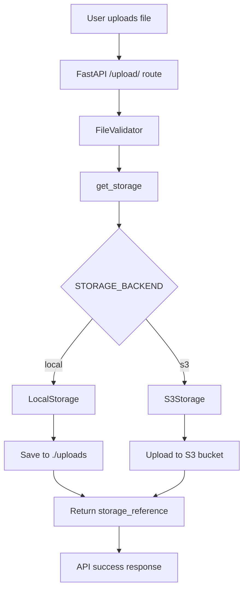

# AccessFlow

FastAPI file upload pipeline with pluggable storage backends (local or AWS S3).

## Architecture



**Core principle:** The upload route depends on the abstract `StorageBackend` interface, not concrete implementations. Storage choice is configuration-driven.

## Components

| Component                  | Purpose                                           |
| -------------------------- | ------------------------------------------------- |
| `POST /upload/`            | File upload endpoint with validation              |
| `GET /health`              | Health check for load balancers                   |
| `FileValidator`            | Extension, name, and size validation              |
| `StorageBackend`           | Abstract interface for storage implementations    |
| `LocalStorage`             | Saves files to `./uploads`                        |
| `S3Storage`                | Uploads files to AWS S3                           |
| `RequestLoggingMiddleware` | Logs request_id and latency_ms in structured JSON |

## Project Structure

```
app/
├── main.py                 # FastAPI app initialization
├── dependencies.py         # Dependency injection (get_settings, get_storage)
├── core/
│   ├── config.py           # Pydantic Settings (env vars)
│   ├── exceptions.py       # Error handlers
│   ├── logger.py           # JSON logging
│   ├── middleware.py       # Request logging middleware
│   └── responses.py        # Standard response models
├── routes/
│   ├── health.py           # GET /health
│   └── upload.py           # POST /upload/
├── validators/
│   └── file_validator.py   # File validation
└── storage/
    ├── base.py             # StorageBackend abstract class
    ├── local.py            # LocalStorage implementation
    └── s3.py               # S3Storage implementation

tests/
├── conftest.py             # Pytest fixtures and dependency overrides
├── test_health.py
└── test_upload.py

scripts/
├── create_s3_bucket.ps1    # Create S3 bucket for testing
└── delete_s3_bucket.ps1    # Delete S3 bucket and all objects
```

## Environment Variables

```env
# App
APP_NAME=AccessFlow
APP_VERSION=1.0.0
DEBUG=false

# Storage
STORAGE_BACKEND=local
STORAGE_PATH=./uploads

# AWS (required for STORAGE_BACKEND=s3)
AWS_REGION=ap-south-1
S3_BUCKET_NAME=accessflow-uploads-raktabh-2026

# Logging
LOG_LEVEL=INFO

# Upload limits
MAX_UPLOAD_SIZE_MB=100
```

**Important:** Do not commit `.env` to version control.

## Running the App

### Setup

```bash
cd acessflow
uv venv
.venv\Scripts\Activate.ps1  # Windows PowerShell
source .venv/bin/activate   # macOS/Linux
uv sync
cp .env.example .env
```

### Start Development Server

```bash
uv run python -m uvicorn app.main:app --reload
```

Server runs at `http://127.0.0.1:8000`

### Docker

```bash
docker build -t accessflow:latest .
docker run -p 8000:8000 -e STORAGE_BACKEND=local accessflow:latest
```

## Testing

### Local Storage Upload

1. Ensure `STORAGE_BACKEND=local` in `.env`
2. Upload a file:

```bash
curl.exe -X POST "http://127.0.0.1:8000/upload/" -F "file=@test.txt"
```

3. Expected response:

```json
{
  "success": true,
  "data": {
    "filename": "test.txt",
    "storage_backend": "local",
    "storage_reference": "uploads/test.txt"
  }
}
```

4. Verify file in `./uploads` directory

### S3 Storage Upload

**Prerequisites:**

- AWS CLI configured with credentials
- S3 bucket created

1. Set `STORAGE_BACKEND=s3` in `.env`
2. Upload a file:

```bash
curl.exe -X POST "http://127.0.0.1:8000/upload/" -F "file=@test.txt"
```

3. Expected response:

```json
{
  "success": true,
  "data": {
    "filename": "test.txt",
    "storage_backend": "s3",
    "storage_reference": "uploads/550e8400-e29b-41d4-a716-446655440000.txt"
  }
}
```

4. Verify file in S3:

```bash
aws s3 ls s3://accessflow-uploads-raktabh-2026/uploads/
```

### Important: Trailing Slash

The upload endpoint **requires** a trailing slash: `/upload/`

Correct: `http://127.0.0.1:8000/upload/`
Incorrect: `http://127.0.0.1:8000/upload` (causes 307 redirect)

## S3 Bucket Scripts

### Create Bucket

```powershell
.\scripts\create_s3_bucket.ps1
```

Creates a private S3 bucket with "Block Public Access" enabled using values from `.env`:

- `S3_BUCKET_NAME` — bucket name
- `AWS_REGION` — bucket region

### Delete Bucket

```powershell
.\scripts\delete_s3_bucket.ps1
```

Deletes all objects in the bucket, then deletes the empty bucket. Enables repeatable S3 testing.

**Workflow:**

```
1. Create bucket: .\scripts\create_s3_bucket.ps1
2. Upload files and test
3. Clean up: .\scripts\delete_s3_bucket.ps1
4. Repeat from step 1
```

## Running Tests

Run all tests:

```bash
uv run pytest tests/ -v
```

Run specific test file:

```bash
uv run pytest tests/test_upload.py -v
```

Run with coverage:

```bash
uv run pytest tests/ --cov=app --cov-report=term-missing
```

Tests use dependency injection to inject mock storage, preventing file I/O and S3 calls during testing.

## Design

- **Dependency Injection:** `get_storage()` returns the configured storage backend
- **Abstract Interface:** `StorageBackend` defines the `save(file_bytes, filename)` contract
- **Configuration-Driven:** `STORAGE_BACKEND` environment variable selects backend at runtime
- **Structured Logging:** All requests logged with `request_id`, `latency_ms`, `level`, `message`
- **Testability:** Fixtures in `conftest.py` allow injecting mock storage for tests

## Security Notes

- Do not commit `.env` (contains secrets)
- On AWS, use IAM roles instead of hardcoded credentials
- Keep S3 buckets private with "Block Public Access" enabled
- Use least-privilege IAM policies for S3 access
