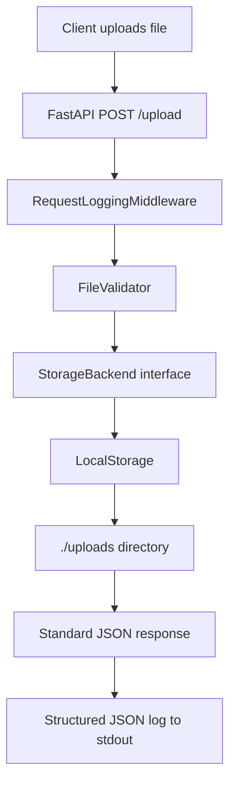
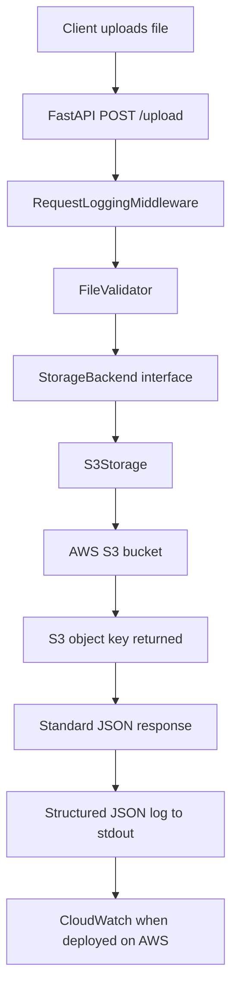
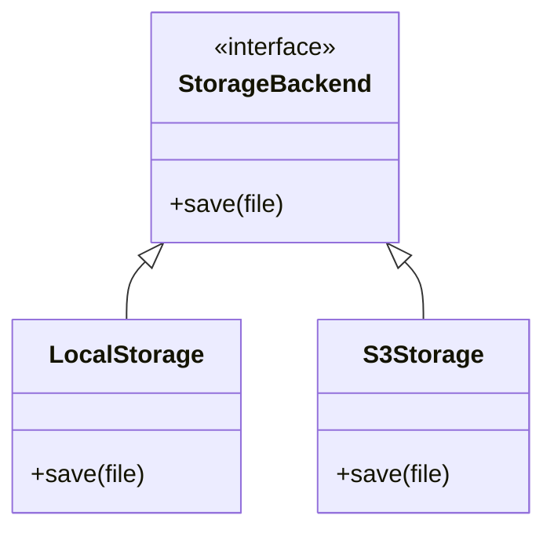
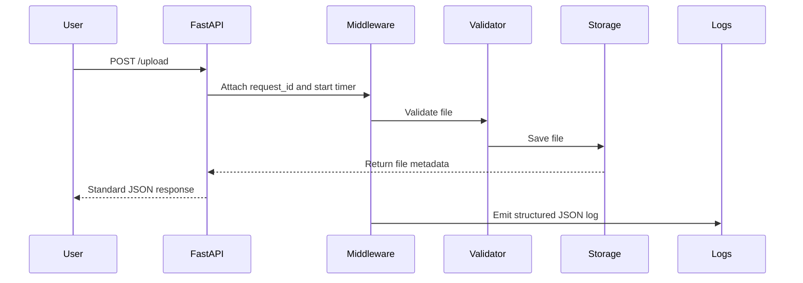
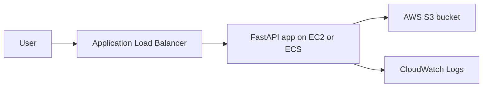

# AccessFlow

[](https://www.python.org/downloads/)
[](https://fastapi.tiangolo.com/)
[](https://www.docker.com/)
[](https://aws.amazon.com/)

A backend learning project demonstrating clean FastAPI architecture, structured observability, and cloud-ready patterns. Built to explore real-world engineering practices: middleware, dependency injection, abstract storage backends, containerization, and a future AWS S3-backed storage layer.

## Overview

AccessFlow is **not a feature-heavy application**. It is a deliberate backend architecture project.

The goal is to build a single, well-architected file upload service that shows how a local backend can gradually evolve into a cloud-ready AWS service.

AccessFlow currently supports local file uploads through `LocalStorage`. The storage layer is intentionally designed so that `S3Storage` can be added later without rewriting the upload route.

## Current Status

| Area | Status |
| --- | --- |
| FastAPI backend | Done |
| `POST /upload` endpoint | Done |
| `GET /health` endpoint | Done |
| Structured JSON logging | Done |
| Request ID + latency logging | Done |
| Docker setup | Done |
| Local file storage | Done |
| Storage abstraction | Done |
| Dependency injection | Done |
| AWS S3 manual lab | Done |
| AWS CLI upload to S3 | Done |
| boto3 upload experiment | Done |
| Full `S3Storage` integration | Planned |

## What I Learned from the S3 Lab

Before integrating S3 into the project, I tested S3 separately.

The S3 learning flow was:

```text
AWS Console
→ Create private S3 bucket
→ Upload file manually
→ Verify object in S3
→ Upload file using AWS CLI
→ Upload file using Python boto3
→ Delete objects and bucket using CLI
```

Key S3 concepts:

```text
S3 = AWS cloud object storage service
Bucket = main storage container
Object = actual uploaded file
Key = path/name used to locate the object inside the bucket
```

Example:

```text
Bucket:
accessflow-uploads-raktabh-2026

Object key:
uploads/boto3-accessflow-test.txt

S3 URI:
s3://accessflow-uploads-raktabh-2026/uploads/boto3-accessflow-test.txt
```

For AccessFlow, the main learning is:

> Instead of storing uploaded files permanently inside the FastAPI server, the app can upload files to S3 and keep only the S3 object key as the reference.

## Stack

| Component | Choice | Why |
| --- | --- | --- |
| **Language** | Python 3.13+ | Modern, clear, fast enough |
| **Framework** | FastAPI | Async, Pydantic validation, auto docs |
| **Config** | pydantic-settings | Type-safe env vars, `.env` support |
| **Package Manager** | uv | Fast, deterministic Python package management |
| **Container** | Docker | Portable runtime, production-style deployment |
| **Storage** | LocalStorage now, S3Storage planned | Clean migration path from local to cloud |
| **Logging** | Structured JSON logs | CloudWatch-friendly log format |
| **Testing** | Pytest + FastAPI TestClient | Integration testing with dependency overrides |
| **Cloud Target** | AWS S3, ALB, EC2/ECS later | Real backend cloud deployment path |

## Current Architecture



Current upload flow:

```text
User uploads file
→ FastAPI /upload
→ FileValidator validates extension/name/size
→ LocalStorage saves file locally
→ Standard JSON response is returned
→ Middleware logs request_id and latency_ms
```

## Target S3 Architecture



Target upload flow:

```text
User uploads file
→ FastAPI /upload
→ FileValidator validates file
→ S3Storage uploads file to S3
→ App returns file metadata and S3 object key
→ Logs remain structured and CloudWatch-ready
```

The important design goal:

> The upload route should not care whether the file is stored locally or in S3.

## Storage Design

AccessFlow uses a pluggable storage architecture.



Current implementation:

```text
StorageBackend
└── LocalStorage
```

Planned implementation:

```text
StorageBackend
├── LocalStorage
└── S3Storage
```

This allows the app to switch storage using configuration instead of changing route logic.

## Request Lifecycle



## AWS Deployment Direction

AccessFlow is designed so it can later run behind an AWS load balancer.



Planned AWS flow:

```text
User
→ ALB
→ FastAPI app running on EC2/ECS
→ Private S3 bucket
→ CloudWatch logs
```

Important cloud principle:

> On AWS, the app should use an IAM role, not hardcoded AWS access keys.

## What's Built

### Core Infrastructure

- Structured JSON logging with `request_id`, `latency_ms`, `level`, and `message`
- Pydantic Settings for type-safe configuration
- Custom `AppException` and centralized error handling
- Request middleware for request tracing and operational logs
- Standardized success/error response format

### Routes

- `POST /upload` — file upload with validation
- `GET /health` — AWS ALB-compatible health check endpoint

### Storage Layer

- `StorageBackend` abstract base class
- `LocalStorage` implementation
- S3-ready design through dependency injection
- boto3 experiment completed separately before full integration

### Validation

- File extension whitelist
- Filename validation to prevent unsafe paths
- File size checks

### Testing

- Integration tests for `/health`
- Integration tests for `/upload`
- Dependency injection overrides for test storage

### DevOps

- Dockerfile
- Non-root container user
- uv-based dependency management
- CloudWatch-ready logging style

## What's Intentionally Not Here

- No database yet
- No authentication yet
- No presigned URLs yet
- No DynamoDB
- No SQS
- No Bedrock
- No RAG
- No Lambda triggers
- No CloudFront
- No complex S3 lifecycle policies yet

The project is intentionally focused on one thing first:

> Build a clean cloud-ready file upload backend.

## Project Structure

```text
.
├── app/
│   ├── main.py                    # FastAPI app initialization
│   ├── dependencies.py            # get_settings(), get_storage()
│   ├── core/
│   │   ├── config.py              # Pydantic Settings model
│   │   ├── exceptions.py          # AppException, error handler
│   │   ├── lifespan.py            # Startup/shutdown lifecycle
│   │   ├── logger.py              # Structured logging
│   │   ├── middleware.py          # Request logging middleware
│   │   └── responses.py           # Standard response model
│   ├── routes/
│   │   ├── health.py              # GET /health
│   │   └── upload.py              # POST /upload
│   ├── validators/
│   │   └── file_validator.py      # File validation logic
│   └── storage/
│       ├── base.py                # StorageBackend abstract base class
│       └── local.py               # LocalStorage implementation
├── tests/
│   ├── conftest.py                # Pytest fixtures and DI overrides
│   ├── test_health.py             # Health endpoint tests
│   └── test_upload.py             # Upload endpoint tests
├── Dockerfile
├── pyproject.toml
├── uv.lock
├── .env.example
└── README.md
```

Planned S3 addition:

```text
app/
└── storage/
    ├── base.py
    ├── local.py
    └── s3.py                     # Planned S3Storage implementation
```

## Quick Start

### Prerequisites

- Python 3.13+
- uv
- Docker optional

### Local Setup with uv

1. Clone and enter the project:

   ```bash
   cd accessflow
   ```

2. Create and activate virtual environment:

   ```bash
   uv venv
   ```

   Windows PowerShell:

   ```powershell
   .venv\Scripts\Activate.ps1
   ```

   macOS/Linux:

   ```bash
   source .venv/bin/activate
   ```

3. Install dependencies:

   ```bash
   uv sync
   ```

4. Configure environment:

   ```bash
   cp .env.example .env
   ```

5. Run development server:

   ```bash
   uv run fastapi dev app/main.py
   ```

6. Test health endpoint:

   ```bash
   curl http://localhost:8000/health
   ```

7. Test upload endpoint:

   ```bash
   curl -X POST -F "file=@path/to/file.txt" http://localhost:8000/upload
   ```

8. Run tests:

   ```bash
   uv run pytest tests/ -v
   ```

## Docker Setup

Build the image:

```bash
docker build -t accessflow:latest .
```

Run the container:

```bash
docker run -p 8000:8000 \
  -v $(pwd)/uploads:/app/uploads \
  accessflow:latest
```

Test:

```bash
curl http://localhost:8000/health
```

## Environment Variables

Current local environment:

```env
APP_NAME=AccessFlow
APP_VERSION=1.0.0
DEBUG=false

STORAGE_PATH=./uploads
MAX_UPLOAD_SIZE_MB=100

LOG_LEVEL=INFO
```

Planned S3 environment variables:

```env
STORAGE_BACKEND=local
AWS_REGION=ap-south-1
S3_BUCKET_NAME=accessflow-uploads-your-name
```

Expected future behavior:

```text
STORAGE_BACKEND=local → use LocalStorage
STORAGE_BACKEND=s3    → use S3Storage
```

## S3 Lab Commands

These commands were used to test S3 outside the actual app integration.

Create a small local file:

```powershell
"hello from aws cli upload" > cli-test.txt
```

Upload using AWS CLI:

```powershell
aws s3 cp cli-test.txt s3://accessflow-uploads-raktabh-2026/uploads/cli-test.txt
```

List uploaded objects:

```powershell
aws s3 ls s3://accessflow-uploads-raktabh-2026/uploads/
```

Delete all objects:

```powershell
aws s3 rm s3://accessflow-uploads-raktabh-2026 --recursive
```

Delete the empty bucket:

```powershell
aws s3 rb s3://accessflow-uploads-raktabh-2026
```

## boto3 Experiment

A standalone boto3 script was used to prove that Python can upload to S3 using local AWS credentials.

```python
import boto3
from botocore.exceptions import ClientError

BUCKET_NAME = "accessflow-uploads-raktabh-2026"
OBJECT_KEY = "uploads/boto3-accessflow-test.txt"
FILE_PATH = "boto3-local-test.txt"


def upload_file():
    s3_client = boto3.client("s3", region_name="ap-south-1")

    try:
        with open(FILE_PATH, "rb") as file_obj:
            s3_client.upload_fileobj(
                Fileobj=file_obj,
                Bucket=BUCKET_NAME,
                Key=OBJECT_KEY,
                ExtraArgs={"ContentType": "text/plain"},
            )

        print("Upload successful")
        print(f"Bucket: {BUCKET_NAME}")
        print(f"Object key: {OBJECT_KEY}")

    except ClientError as error:
        print("Upload failed")
        print(error)


if __name__ == "__main__":
    upload_file()
```

This proves the future app flow:

```text
Python
→ boto3
→ AWS credentials
→ S3 bucket
→ uploaded object
```

## Security Notes

For local learning, AWS CLI credentials can be used.

For AWS deployment:

```text
Do not hardcode AWS access keys
Do not commit secrets to GitHub
Use IAM roles on EC2/ECS
Use least-privilege S3 permissions
Keep S3 Block Public Access enabled
```

Minimum future app permission for upload-only behavior:

```json
{
  "Version": "2012-10-17",
  "Statement": [
    {
      "Sid": "AccessFlowUploadOnly",
      "Effect": "Allow",
      "Action": ["s3:PutObject"],
      "Resource": "arn:aws:s3:::accessflow-uploads-your-name/uploads/*"
    }
  ]
}
```

## Next Steps

### Short Term

- [ ] Add `STORAGE_BACKEND` setting
- [ ] Add `AWS_REGION` and `S3_BUCKET_NAME` settings
- [ ] Create `app/storage/s3.py`
- [ ] Implement `S3Storage(StorageBackend)`
- [ ] Update `get_storage()` to switch between local and S3
- [ ] Keep `/upload` route mostly unchanged

### Medium Term

- [ ] Run AccessFlow locally with `STORAGE_BACKEND=s3`
- [ ] Test S3 upload through FastAPI
- [ ] Add S3 integration tests with mocked storage
- [ ] Update Docker environment handling

### Cloud Deployment

- [ ] Run app on EC2 or ECS
- [ ] Attach IAM role with S3 permissions
- [ ] Place app behind ALB
- [ ] Send structured logs to CloudWatch
- [ ] Use `/health` for ALB health checks

### Later, Not Now

- [ ] Presigned URLs
- [ ] Database metadata table
- [ ] Authentication
- [ ] File download endpoint
- [ ] S3 lifecycle rules
- [ ] CloudFront

## Learning Outcomes

This project demonstrates competency in:

- Backend architecture
- FastAPI dependency injection
- Pluggable storage design
- File validation
- Structured logging
- Dockerized backend development
- AWS S3 basics
- AWS CLI workflow
- Python boto3 usage
- Cloud-ready thinking
- IAM least-privilege planning

## Final Project Goal

After completing the S3 integration, this project should demonstrate:

> I converted a local FastAPI file upload service into a cloud-ready AWS S3-backed file upload service using clean architecture, dependency injection, IAM permissions, Docker, and CloudWatch-ready logging.

## License

MIT
